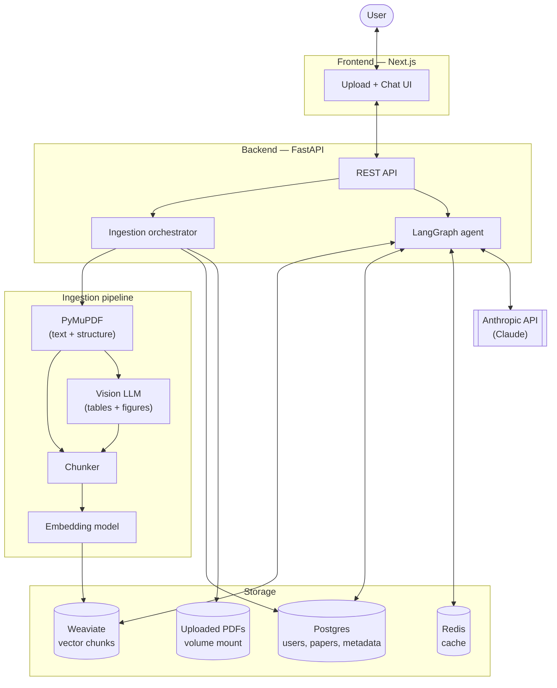

# agentic-research-assistant

An assistant for technical academic papers: upload a PDF, get a structured
summary that incorporates insights from tables and figures, with claims
annotated by how well-supported they are and where open questions remain.

## Architecture

## Components

### Frontend — Next.js
Where users upload papers and chat with the assistant. Talks to the backend
over a REST API. Lives in `frontend/`.

### Backend — FastAPI
Entry point for everything: receives uploads, kicks off ingestion, and routes
chat turns through the agent. Lives in `backend/`.

### Ingestion pipeline
Runs once per uploaded paper.

- **PyMuPDF** — extracts text and basic layout from the PDF. Cheap and fast,
  good baseline. May later be augmented with a layout-aware parser (e.g.
  Unstructured, Marker) for cleaner section and heading boundaries.
- **Vision LLM pass** — processes tables and figures that don't survive plain
  text extraction. Produces structured descriptions / extracted values that
  get chunked alongside the body text so they're retrievable too.
- **Chunker** — splits the cleaned content into retrieval-sized chunks,
  preserving section context for citation.
- **Embedding model** — turns each chunk into a vector for storage in Weaviate.

### Agent — LangGraph
Orchestrates the conversation: retrieves relevant chunks from Weaviate,
decides when to pull in figure-derived chunks vs. body text, and structures
responses around the three goals — summary, table/figure insights, and an
evidence-strength assessment (what's well-supported vs. where the literature
has gaps). Calls Claude for the actual generation.

### Storage

- **Weaviate** — vector store. Holds embedded chunks of paper text and figure
  descriptions. Source of truth for retrieval.
- **Postgres** — relational metadata: users, paper records, chunk → paper
  mappings, conversation history.
- **Redis** — cache layer. Likely uses: embedding lookups, LLM response
  caching, avoiding re-parse of already-ingested PDFs. Role may evolve —
  could also back LangGraph state checkpoints if conversations get long.
- **Uploaded PDFs** — raw files live on a mounted volume (`uploads/`) so
  re-parsing is possible without re-uploading.

### LLM — Anthropic API (Claude)
Generation and reasoning. Called by the LangGraph agent for both
retrieval-augmented answers and the structured summary / gap analysis.
